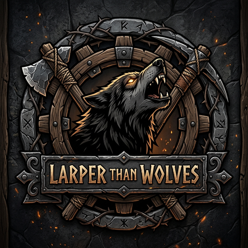

<div align="center">

# 🐺 Larper Than Wolves

<p align="center">
  
</p>

### *Хардкорное выживание для Minecraft 1.21.1 (NeoForge), вдохновлённое Better Than Wolves*

[](https://www.curseforge.com/minecraft/mc-mods/larper-than-wolves)
[](https://modrinth.com/mod/larper-than-wolves)
[](https://github.com/MarryBye/Larper-Than-Wolves/releases)

[](https://minecraft.net)
[](https://neoforged.net)
[](https://openjdk.org)
[](LICENSE)

<br/>

**Larper Than Wolves** (`larperthanwolves`) полностью переосмысливает раннюю и среднюю игру Minecraft: инструменты из кремния, меди и бронзы, древесные пни и ручная обтёска верстака, обязательное удобрение грядок костной мукой и навозом, ручная молотилка с рукоятью, плетение корзинок и сеток, сушилка и дублёная кожа, строгая специализация печей и хардкорная прогрессия без ванильных скипов.

</div>

---

## 🌟 Главные особенности и механики

### ⚙️ Молотилка (*Hand Mill*), Рукоять (*Crank*) и Интеграция с Create
* **Молотилка (*Hand Mill*)**: ранний механический станок для перемалывания слитков, руд, минералов и органики в пыль и мелкие фракции.
  * **Крафт**: 4 Гладких камня + 2 Бронзовых слитка + 2 Доски + 1 Камень.
  * **Индикатор прогресса**: анимированная стрелка в интерфейсе (24x17) плавно заполняется по ходу помола от 0% до 100%.
  * **Управление рукоятью**: сверху устанавливается **Рукоять молотилки (*Mill Crank*)** (крафтится из 3 палок и 1 верёвки). Имеет полноценную крупную 3D-модель (в блоке и в инвентаре) в стилистике Create.
  * **Механика прокрутки (ПКМ)**: каждый клик ПКМ по рукояти запускает плавный оборот (1 полный оборот = **0.5 секунды / 10 тиков**). За каждый оборот добавляется **5%** прогресса (ровно **20 оборотов**).
  * **Автоматизация вращением из Create**:
    * Молотилка поддерживает автоматизацию при помощи кинетической энергии (валов, шестерней, водяных колёс, мельниц и двигателей).
    * Скорость помола напрямую масштабируется от оборотов в минуту (**RPM**): чем выше скорость вращения механизма, тем быстрее происходит помол!
    * Поддерживается работа с ручкой из Create (*Hand Crank*).
  * **Базовые пропорции помола**:
    * **1 Слиток (Железо, Медь, Золото, Олово, Бронза)** $\rightarrow$ **8 Пылей** (2 пыли = 1 самородок, 4 самородка = 1 слиток).
    * **1 Алмаз** $\rightarrow$ **8 Алмазной пыли**.
    * **1 Алмазный слиток** $\rightarrow$ **8 Алмазной пыли + 8 Железной пыли + 8 Медной пыли** (полное сохранение всех компонентов сплава).
    * **1 Кусок сырой руды / Самородок** $\rightarrow$ **2 Пыли**.
    * **Камни / Песчаник** $\rightarrow$ **Гравий / Песок / Осколки кремня**.
* **Переработка костей и ребаланс костной муки**:
  * Обычный ванильный крафт костной муки из костей и костных блоков в верстаке/инвентаре **полностью удалён**.
  * Костную муку можно получить **только перемалыванием в молотилке**: **2 Кости $\rightarrow$ 1 Костная мука**.
  * **Реалистичный дроп костей из мобов**: кости теперь выпадают при забое мирных животных (коровы, овцы, свиньи, лошади, верблюды, нюхачи — 30% шанс на 1-2 кости; куры, кролики — 15%) и зомби/их подвидов (зомби, кадавры, утопленники, зомби-крестьяне, зомбифицированные пиглины, зоглины — 25% шанс).

---

### 🌲 Пни под деревьями (*Tree Stumps*), Стамеска (*Chisel*) и Рубка дерева
* **Древесные пни (*Stumps*)**: нижний блок ствола каждого естественно сгенерированного дерева в мире превращается в пень соответствующей породы дерева (дубовый, берёзовый, еловый, тропический, акациевый, тёмного дуба, мангровый, вишнёвый, багровый, искажённый).
* **Свойства пней**: тёмное корневое основание, ультра-высокая прочность (твёрдость 25.0).
* **Создание верстака**: брёвна и доски нельзя превратить в верстак в инвентаре. **Только пень** можно обтесать стамеской в 4 последовательных этапа (Пень $\rightarrow$ Рабочий пенёк 1-3 $\rightarrow$ Полноценный Верстак).
* **Рубка деревьев и получение досок**:
  * Деревья, брёвна и доски **нельзя сломать голыми руками** (требуется топор).
  * **Крафт досок в инвентаре (2x2)**: 1 Бревно + 1 Топор $\rightarrow$ **2 Доски** (топор теряет 1 прочность и остаётся в сетке).
  * **Крафт на верстаке (3x3)**: 1 Бревно $\rightarrow$ **4 Доски** (полный выход без траты прочности топора).

---

### 🌿 Ветки (*Twigs*), Лесная фуражировка и Ножницы
* **Веточки на земле**: естественно генерируются под пологом деревьев в лесах, тайге, джунглях и болотах (0–2 шт. на полянку). Собираются моментально кликом или разрушением рукой.
* **Дроп из листвы**: при разрушении или естественном опадании листвы деревьев выпадает 1–2 веточки с шансом **35%** (если не срезать ножницами).
* **Крафт палок**: 2 Веточки в сетке крафта $\rightarrow$ **1 Палка**.
* **Кремниевые ножницы (*Silicon Shears*)**: аутентичный ранний инструмент с ручками из деревянных веток, обмотанных шнуром, и кремниевыми лезвиями.

---

### 🏺 Раскопки грунтов, Глина и Богатые почвы (*Rich Soils*)
* **Добыча глины (*Clay Mining*)**:
  * **Строгое требование лопаты**: глиняные блоки (`minecraft:clay`) добываются **исключительно лопатой**.
  * **Разрушение рукой/другими инструментами**: ломает блок впустую с **0 дропа**.
  * **Выход глины**: при раскопке лопатой выпадает ровно **1 комочек глины** (вместо ванильных 4).
  * **Скорость копания**: глина копается плотнее и медленнее (~1.6x–1.8x).
* **Обычные грунты (гравий, песок, красный песок, земля)**:
  * При разрушении и просеивании дают: **Осколки кремня** (20–30%), **Кремень** (8–15%), **Медную пыль** (2–5%).
  * Землю теперь можно просеивать в сите наравне с гравием и песком.
* **Богатые почвы (*Rich Soils*)**:
  * 5 разновидностей: **Богатая трава** (`rich_grass_block`), **Богатая земля** (`rich_dirt`), **Богатый гравий** (`rich_gravel`), **Богатый песок** (`rich_sand`), **Богатый красный песок** (`rich_red_sand`).
  * Текстуры с серебристыми минеральными вкраплениями.
  * **Требование добычи**: для сбора самого богатого блока требуется лопата **медного уровня и выше** (иначе выпадет обычная земля/песок/гравий).
  * **Просеивание в сите**: даёт богатый спектр металлов: осколки кремня, кремень, медную, оловянную, бронзовую, железную, золотую и алмазную пыль.
  * **Генерация**: спавнятся крупными жилами (размер 20, 10–12 попыток на чанк) среди своих обычных грунтов.

---

### 🧵 Ручное плетение сетки и Плетёная корзинка (*Basket*)
* **Несвязанная сетка (*Unbound Mesh*) $\rightarrow$ Сетка (*Mesh*)**:
  * Крафт: 2 Палки + 2 Верёвки $\rightarrow$ **Несвязанная сетка**.
  * **Ручное связывание**: зажмите ПКМ с несвязанной сеткой в руке на **15 секунд** (анимация работы обеими руками + непрерывный шелестящий звук плетения).
  * **Прогресс-бар**: полоска прочности динамически заполняется от 0 до 15 секунд. Накопленный прогресс сохраняется при прерывании.
  * По истечении 15 секунд предмет превращается в готовую **Сетку** (`mesh`).
* **Плетёная корзинка (*Woven Basket*)**:
  * Раннее хранилище для ресурсов, доступное до верстака и сундуков.
  * **Крафт**: 4 Сетки в сетке 2x2 $\rightarrow$ **Корзинка**.
  * **Вместимость**: 9 слотов (контейнер 3x3).
  * **3D-модель**: красивая плетёная текстура, утолщённый обод, деревянная арочная ручка с перевязками.
  * **Автоматизация**: поддерживает загрузку и выгрузку через воронки со всех сторон (`WorldlyContainer`). При разрушении топором выпадает корзинка и всё содержимое.

---

### 🌾 Сельское хозяйство, Удобрения (Костная мука и Навоз) и 2-стадийная вспашка
* **Обязательное удобрение почвы (*Fertilized Farmland*)**:
  * Обычной посадки семян в увлажнённую вспаханную землю **недостаточно** — на неудобренной грядке рост культур полностью заблокирован.
  * Чтобы растение начало расти, по вспаханной земле или посаженному растению необходимо **кликнуть ПКМ удобрением**.
  * **Виды удобрений и ресурс**:
    * **Костная мука (*Bone Meal*)**: даёт **1 цикл сбора урожая** (после сбора почва истощается обратно в обычную пашню).
    * **Навоз (*Dung*)**: мощное долговременное органическое удобрение, обеспечивающее **3 полных цикла сбора урожая**. При каждом сборе урожая заряд уменьшается на 1 (3 $\rightarrow$ 2 $\rightarrow$ 1 $\rightarrow$ обычная пашня).
  * **Механика роста**: удобрения **не ускоряют** и не перелистывают фазы роста мгновенно, а открывают естественный рост культуры.
  * **Визуализация**: удобренная земля получает уникальную текстуру с минеральными белыми крапинками (для сухой и увлажнённой почвы).
* **Производство навоза животными (*Animal Digestion*)**:
  * Животные (коровы, овцы, свиньи, лошади, козы, верблюды, нюхачи, волки и др.) оставляют **Навоз (*Dung*)** ровно через **3 минуты (3600 тиков)** после того, как поели.
  * Запускается при кормлении игроком (пшеница, морковь, картофель, свёкла, мясо и др.), поедании овцами травы с земли и охоте волков на дикую добычу.
* **2-стадийная вспашка мотыгой**:
  * **Стадия 1 (Трава/Подзол/Мицелий/Богатая трава $\rightarrow$ Земля/Богатая земля)**: клик ПКМ любой мотыгой по травяному покрову спахивает дёрн в землю с **35% шансом** добыть дикие семена (пшеница 50%, морковь 15%, картофель 15%, свёкла 10%, тыква 5%, арбуз 5%).
  * **Стадия 2 (Земля/Богатая земля $\rightarrow$ Пашня)**: повторный клик ПКМ мотыгой по земле подготавливает грядку под посадку культур.
  * Разрушение (ЛКМ) травы ломает блок без выпадения диких семян.

---

### 🐾 Дикая фауна, Охота волков и Поведение животных
* **Охота волков на всех зверей**:
  * Дикие волки теперь охотятся **на всех мирных животных** (коровы, свиньи, овцы, куры, кролики, лошади, ослы, мулы, ламы, козы и др.), а не только на овец и кроликов.
  * Скот в загонах или на пастбищах без защиты хищников находится в постоянной опасности.
* **Быстрое бегство животных**:
  * Все мирные животные при получении урона получают мощный прирост к скорости (**Скорость II**) и активно прокладывают маршрут бегства в противоположную от атакующего сторону.
* **Защитный удар коровы копытами (*Cow Kick*)**:
  * Если игрок или другой атакующий бьёт корову вплотную в ближнем бою ($\le 3.0$ блоков), корова резко **лягает обидчика задними копытами**!
  * **Урон и отдача**: наносит **5.0 урона (2.5 сердца)** и с силой отбрасывает игрока назад с тяжёлым звуком удара и искрами.
  * Сразу после удара корова мгновенно даёт дёру на повышенной скорости (**Скорость III**).

---

### ☀️ Сушилка (*Drying Rack*) и Дубовая кожа
* **Сушилка**: создаётся из 4 палок в сетке 2x2. Пассивно работает на открытом воздухе в дневное время при ясной погоде.
  * **Трава** (короткая, высокая, папоротник, морская трава) $\rightarrow$ **Сухая трава** (растопка для печей и шнуры).
  * **Обычная кожа** $\rightarrow$ **Дублёная кожа (*Tanned Leather*)**.
  * **Крафт верёвки**: верёвки крафтятся **строго из дублёной кожи** с ножницами (или из сухой травы/лиан).

---

### 🍞 Духовка (*Oven*) и Кирпичная печь (*Brick Furnace*)
* **Духовка (*Oven*)**: печь для приготовления пищи (крафтится из кирпичной печи + железного самородка или 2 кирпичных плит + 2 кирпичей).
  * **Только еда**: принимает исключительно сырое мясо, рыбу, картофель, ламинарию. Не принимает руды и блоки.
  * Требует ручной загрузки топлива и розжига зажигалкой или огнивом.
* **Кирпичная печь (*Brick Furnace*)**: заменяет ванильную печь и плавильню.
  * **Только руды и блоки**: еда в кирпичную печь не помещается.
  * 4 стадии горения, поддержка автоподачи топлива воронками сзади.

---

## ⛏️ Технологические тиры инструментов

| Тир | Материал | Прочность | Скорость | Что добывает | Особенности добычи |
| :--- | :--- | :---: | :---: | :--- | :--- |
| **1** | **Кремний** (*Silicon*) | **30** | 2.5 | Уголь, Медная руда, Камень, Гранит, Диорит, Андезит, Кальцит, Песчаник | Медь дропает **пыль**; камни — **камешки (2–4 шт)**; песчаник — **песок**. Лопата добывает глину (1 шт). Глубинный сланец и руды $Y \le 0$ копать нельзя. |
| **2** | **Медь** (*Copper*) | **100** | 4.5 | Уголь, Медь (сырая), Олово (пыль), Камни, Кальцит, Песчаник | Лопата добывает **богатые почвы** и глину. $Y \le 0$ копать нельзя. |
| **3** | **Бронза** (*Bronze*) | **150** | 5.5 | Уголь, Медь (сырая), Олово (сырое), Железо (пыль), Камни, Кальцит, Песчаники, Глубинные камешки | Добывает камни **камешками**; капельник/туф/сланец/незерак — **самородками-камешками (2–4 шт)**. Лопата добывает богатые почвы и глину. |
| **4** | **Железо** (*Iron*) | **250** | 6.0 | Все руды, Глубинный сланец, Цинк (`create:raw_zinc`), Адский кварц, Чернит, Базальт, Эндерняк | Полноценная добыча руд и блоков в виде целых кусков. Обсидиан и древние обломки не добывает. |
| **5** | **Укреплённое железо** (*Reinforced Iron*) | **500** | 8.0 | Все блоки, включая **Обсидиан** и **Древние обломки** | Алмазный тир (крафтится из алмазных слитков в смешивателе сплавов). |
| **6** | **Незерит** (*Netherite*) | **2031** | 9.0 | Все блоки игры | Финальный тир. |

---

## 🛡️ Баланс брони

| Комплект | Защита (Ш/Н/П/Б) | Общая защита | Твёрдость (Toughness) | Множитель прочности |
| :--- | :---: | :---: | :---: | :---: |
| **Кожаная** (из дублёной кожи) | 1 / 2 / 3 / 1 | 7 | 0.0 | 5 |
| **Медная** | 1 / 3 / 4 / 1 | 9 | 0.0 | 8 |
| **Бронзовая** | 2 / 4 / 5 / 2 | 13 | 0.0 | 12 |
| **Железная** | 2 / 5 / 6 / 2 | 15 | 0.0 | 15 |
| **Укреплённое железо** | 3 / 6 / 8 / 3 | 20 | 1.5 | 25 |
| **Незеритовая** | 3 / 6 / 8 / 3 | 20 | 3.0 | 37 |

---

## 🧪 Металлургия и Смеситель сплавов (*Alloy Mixer*)

1. **Цепочка переработки металлов**:
   * 2 Рудные пыли $\rightarrow$ 1 Сырая руда (кусок).
   * 1 Сырая руда $\rightarrow$ обжиг в печи $\rightarrow$ 1 Самородок.
   * 4 Самородка $\rightarrow$ 1 Слиток.
2. **Сплавы в смесителе (*Alloy Mixer*)**:
   * **Бронзовый слиток**: 2 медных слитка + 1 оловянный слиток.
   * **Латунный слиток (*Create Brass*)**: 1 медный слиток + 1 цинковый слиток.
   * **Алмазный слиток**: 1 алмаз + 1 железный слиток + 1 медный слиток.
3. **Алмазы**:
   * 2 Алмазные пыли $\rightarrow$ 1 Алмазный самородок.
   * 4 Алмазных самородка $\rightarrow$ 1 Алмаз.

---

## 🏘️ Мир, Деревни и Баланс сундуков

* **Редкость деревень**: деревни генерируются редко и **не ближе 3000 блоков** от спавна мира.
* **Рабочие места жителей**: ванильные коптильни и плавильни в деревнях заменены духовками и кирпичными печами.
* **Торговля жителей**: бронники, оружейники и кузнецы инструментов продают снаряжение максимум **до бронзового уровня**.
* **Железные големы**: при смерти дропают **только маки** (0 железа).
* **Лут сундуков**: во всех структурах (шахты, крепости, храмы, аванпосты) железная и алмазная экипировка заменена медной/бронзовой, а слитки — самородками и пылями.

---

## ⚙️ Совместимость с Create 6.0.10 и JEI

* **Create**:
  * Механический смеситель с подогревом: создание бронзы, латуни, алмазных слитков.
  * Мельница и дробящие колеса: дробление пород и руд в пыли и камешки.
  * Веер (промывка/обжиг/копчение): обжиг сырых руд в самородки, сушка травы и дубление кожи.
  * Механическая пила: распил брёвен и пней на 4 доски.
* **JEI (Just Enough Items)**:
  * Интерактивные вкладки для смешивания сплавов, просеивания, вытёсывания стамеской, сушки на солнце, сушилки, топлива и поджога, дропа грунтов.
  * Подробные информационные страницы по всем предметам и уникальным механикам мода.

---

## 📦 Сборка и установка

1. Скачайте `larperthanwolves-1.21.0.jar` из раздела [Releases](https://github.com/MarryBye/Larper-Than-Wolves/releases).
2. Поместите файл в папку `mods` вашего профиля Minecraft 1.21.1 с установленным **NeoForge 21.1.248+**.
3. Запустите игру.

Для сборки из исходного кода:
```bash
./gradlew build
```
Готовый JAR-файл создаётся в директории `build/libs/`.

---

## 👥 Авторы и благодарности

* **Автор и разработчик**: [MarryBye](https://github.com/MarryBye)
* **AI-ассистирование**: разработка и поддержка проекта выполнены в сотрудничестве с искусственным интеллектом **Gemini** (Google DeepMind).
* **Вдохновение**: оригинальный мод *Better Than Wolves* (FlowerChild).

---

## 📄 Лицензия

Проект распространяется под открытой лицензией [MIT License](LICENSE).
Авторские права (c) 2026 MarryBye.
