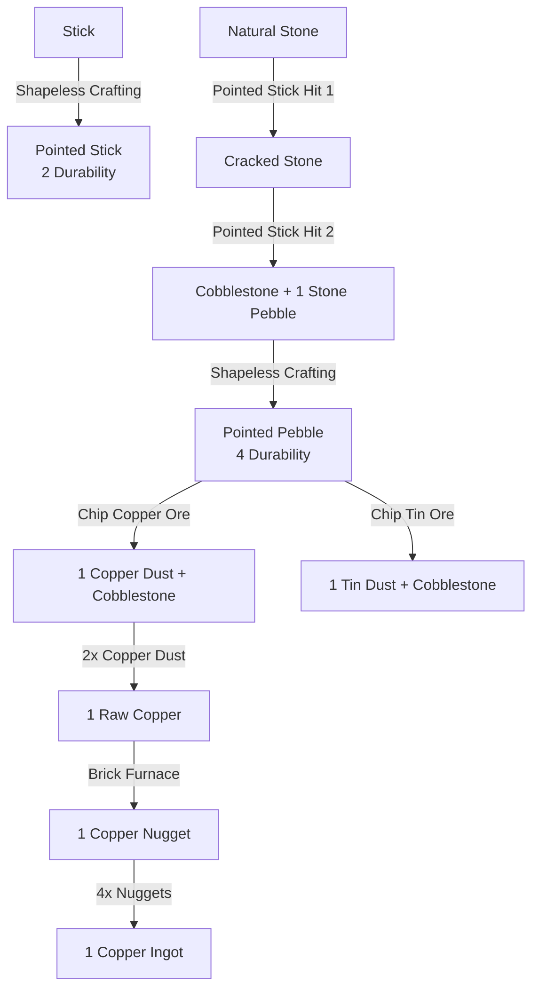

# Early Stone & Ore Gathering (Pointed Stick, Pointed Pebble & Cracked Stone)

This document describes the very early-game primitive resource acquisition mechanics introduced to allow players to gather stone pebbles, cobblestone, and metal dusts before crafting a chisel, work stump, or pickaxe.

---

## ⚙️ Mechanics & Working Principles

### 1. Pointed Stick (`pointed_stick` / Заострённая палка)
- **Durability**: 2 uses.
- **Crafting**: 1 Stick in any crafting grid (shapeless) $\rightarrow$ 1 Pointed Stick.
- **Stone Gathering & 2-Stage Cracking**:
  - **Stage 1 (Natural Stone $\rightarrow$ Cracked Stone)**:
    - Breaking a standard Stone block (`minecraft:stone`) with a Pointed Stick fractures the rock face without destroying it.
    - The block transforms into **Cracked Stone** (`larperthanwolves:cracked_stone`).
    - The Pointed Stick takes **1 durability damage**.
    - Plays stone hit sounds and spawns stone particle effects.
  - **Stage 2 (Cracked Stone $\rightarrow$ Cobblestone + Pebble)**:
    - Breaking a Cracked Stone block (`larperthanwolves:cracked_stone`) with a Pointed Stick breaks off a solid chunk.
    - The block transforms into **Cobblestone** (`minecraft:cobblestone`).
    - Spawns **1 Stone Pebble / Nugget** (`larperthanwolves:stone_nugget`) as a dropped item entity.
    - The Pointed Stick takes **1 durability damage** (exhausting its 2 uses and breaking the stick).
    - Cobblestone remains in place and cannot be mined further with sticks.

### 2. Pointed Pebble (`pointed_pebble` / Заострённый камешек)
- **Durability**: 4 uses.
- **Crafting**: 1 Pebble of any type (`#larperthanwolves:pebbles`) in crafting grid $\rightarrow$ 1 Pointed Pebble.
- **Supported Pebble Types**:
  - Stone Nugget (`stone_nugget`), Diorite Nugget, Granite Nugget, Andesite Nugget, Tuff Nugget, Calcite Nugget, Deepslate Nugget, Dripstone Nugget, Netherrack Nugget.
- **Ore Chipping Mechanic**:
  - **Copper Ore Chipping**:
    - Breaking a Copper Ore block (`minecraft:copper_ore` or `minecraft:deepslate_copper_ore`) with a Pointed Pebble chips out pure metal flakes.
    - Spawns **1 Copper Dust** (`larperthanwolves:copper_dust`).
    - The ore block is **depleted and replaced with Cobblestone** (`minecraft:cobblestone`).
    - Consumes **1 durability** of the Pointed Pebble.
  - **Tin Ore Chipping**:
    - Breaking Tin Ore (`larperthanwolves:tin_ore` or `larperthanwolves:deepslate_tin_ore`) with a Pointed Pebble chips out **1 Tin Dust** (`larperthanwolves:tin_dust`).
    - The ore block is replaced with Cobblestone.
    - Consumes **1 durability** of the Pointed Pebble.
  - The resulting Cobblestone blocks cannot be mined with pebbles or sticks (requiring pickaxes).

### 3. Cracked Stone (`cracked_stone` / `ModBlocks.CRACKED_STONE`)
- **Properties**: Stone material, hardness 1.5, requires correct tool for drops.
- **Pickaxe Interaction**: When mined with any pickaxe (Silicon, Copper, Bronze, Iron, Reinforced Iron, Netherite), behaves identically to Stone, yielding pebbles (or cobblestone for Iron+ tiers).

---

## 📦 Crafting & Progression

---

## 🧪 Testing Guide & Edge Cases

1. **Pointed Stick Crafting**: Place 1 stick in 2x2 crafting grid. Verify 1 Pointed Stick is crafted with 2 max durability.
2. **Stone Cracking (Hit 1)**: In Survival, strike a `minecraft:stone` block holding Pointed Stick.
   - Verify block turns into `larperthanwolves:cracked_stone`.
   - Verify tool durability drops to 1/2.
3. **Stone Cracking (Hit 2)**: Strike the `larperthanwolves:cracked_stone` holding Pointed Stick.
   - Verify block turns into `minecraft:cobblestone`.
   - Verify 1 `larperthanwolves:stone_nugget` is dropped.
   - Verify Pointed Stick breaks with tool break sound and particles.
4. **Pointed Pebble Crafting**: Place any nugget/pebble in crafting grid. Verify 1 Pointed Pebble is crafted with 4 max durability.
5. **Copper Ore Chipping**: Strike a `minecraft:copper_ore` block with Pointed Pebble.
   - Verify block turns into `minecraft:cobblestone`.
   - Verify 1 `larperthanwolves:copper_dust` drops.
   - Verify Pointed Pebble loses 1 durability.
6. **Cobblestone Barrier**: Attempt to break cobblestone with Pointed Stick or Pointed Pebble. Verify mining is prevented (0 speed / cancel).

---

## 📂 Key Source Files
- Block: `src/main/java/io/marrybye/github/larperthanwolves/block/ModBlocks.java`
- Items: `src/main/java/io/marrybye/github/larperthanwolves/item/ModItems.java`
- Event Handlers: `src/main/java/io/marrybye/github/larperthanwolves/event/BlockBreakHandler.java`
- Recipes: `src/main/resources/data/larperthanwolves/recipe/pointed_stick.json`, `pointed_pebble.json`
- Tags: `src/main/resources/data/larperthanwolves/tags/item/pebbles.json`
- Textures: `src/main/resources/assets/larperthanwolves/textures/item/pointed_stick.png`, `pointed_pebble.png`, `textures/block/cracked_stone.png`
